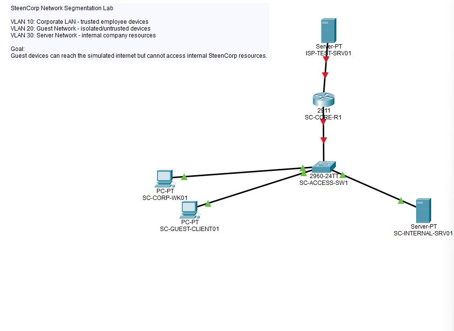

# SteenCorp Network Segmentation Lab


## Overview

The SteenCorp Network Segmentation Lab is a Cisco Packet Tracer project designed to demonstrate basic business network segmentation.

This lab shows how a company can separate trusted corporate devices, internal servers, and guest devices using VLANs, inter-VLAN routing, and access control rules.

The main goal of this project is to prove that guest devices can be isolated from internal company resources while still being allowed to reach a simulated internet/test network.

---

## Project Purpose

This project builds on the networking foundation from my SteenCorp Enterprise IT Lab.

In the original SteenCorp lab, I configured and validated the internal domain network using:

- `192.168.10.0/24` internal LAN
- DC01 as the domain controller
- DNS and DHCP services
- Windows Server and Windows 11 domain connectivity
- VMware network isolation

This project expands that idea into a segmented network design.

Instead of placing every device on one flat network, this lab separates devices by purpose and trust level.

---

## Lab Scenario

SteenCorp wants to provide guest network access without allowing guest devices to reach internal company systems.

The business requirement is:

- Corporate users should be able to access internal resources.
- Internal servers should be separated from guest devices.
- Guest devices should not be able to access internal company resources.
- Guest devices should still be able to reach a simulated internet/test server.

This creates a simple but realistic network security scenario.

---

## Network Design

| Network | VLAN | Subnet | Purpose |
|---|---:|---|---|
| Corporate LAN | VLAN 10 | `192.168.10.0/24` | Trusted employee devices |
| Guest Network | VLAN 20 | `192.168.20.0/24` | Guest/untrusted devices |
| Server Network | VLAN 30 | `192.168.30.0/24` | Internal company resources |
| Internet/Test Network | N/A | `203.0.113.0/24` | Simulated outside access |

---

## Device Naming

| Device | Purpose |
|---|---|
| `SC-CORE-R1` | Core router providing inter-VLAN routing |
| `SC-ACCESS-SW1` | Access switch with VLAN assignments |
| `SC-CORP-WK01` | Trusted corporate workstation |
| `SC-GUEST-CLIENT01` | Guest/untrusted client device |
| `SC-INTERNAL-SRV01` | Internal SteenCorp server resource |
| `ISP-TEST-SRV01` | Simulated internet/test server |

---

## Topology

The lab uses a simple Packet Tracer topology:

- 1 router
- 1 switch
- 1 corporate workstation
- 1 guest workstation
- 1 internal server
- 1 simulated internet/test server

```text
                  ISP-TEST-SRV01
                         |
                    SC-CORE-R1
                         |
                  SC-ACCESS-SW1
          /              |              \
 SC-CORP-WK01   SC-GUEST-CLIENT01   SC-INTERNAL-SRV01
    VLAN 10           VLAN 20             VLAN 30
```



---

## Access Control Goals

| Source | Destination | Expected Result |
|---|---|---|
| Corporate PC | Internal Server | Allowed |
| Corporate PC | Internet/Test Server | Allowed |
| Guest PC | Internal Server | Blocked after ACL |
| Guest PC | Corporate LAN | Blocked after ACL |
| Guest PC | Internet/Test Server | Allowed |

The main security goal is to keep the guest network isolated from internal SteenCorp resources while still allowing guest access to the simulated outside network.

---

## Implementation Summary

### VLAN Segmentation

Separate VLANs were created to divide the network by device type and trust level.

| VLAN | Name | Purpose |
|---|---|---|
| VLAN 10 | `SteenCorp_Corporate` | Trusted employee workstation network |
| VLAN 20 | `SteenCorp_Guest` | Guest/untrusted device network |
| VLAN 30 | `SteenCorp_Servers` | Internal company server network |

The switch ports were assigned based on the connected device:

| Switch Port | Connected Device | VLAN |
|---|---|---|
| `Fa0/1` | `SC-CORE-R1` | Trunk link |
| `Fa0/2` | `SC-CORP-WK01` | VLAN 10 |
| `Fa0/3` | `SC-GUEST-CLIENT01` | VLAN 20 |
| `Fa0/4` | `SC-INTERNAL-SRV01` | VLAN 30 |

This prevents all devices from existing on one flat network.

---

### Inter-VLAN Routing

Router-on-a-stick was used to allow controlled routing between VLANs.

A single physical router interface was connected to the access switch as a trunk, and separate router subinterfaces were created for each VLAN.

Each subinterface was assigned an 802.1Q VLAN tag and an IP address to act as the default gateway for that VLAN.

| VLAN | Router Subinterface | Gateway |
|---|---|---|
| VLAN 10 | `G0/0.10` | `192.168.10.1` |
| VLAN 20 | `G0/0.20` | `192.168.20.1` |
| VLAN 30 | `G0/0.30` | `192.168.30.1` |
| Internet/Test Network | `G0/1` | `203.0.113.1` |

This allowed routing between the Corporate, Guest, Server, and simulated Internet/Test networks before access control rules were applied.

---

### Guest Network Isolation

An extended access control list was applied to prevent guest devices from accessing internal SteenCorp resources.

The guest network was restricted from reaching:

- Corporate LAN
- Internal server network

The guest network was still allowed to reach the simulated internet/test network.

The ACL was applied inbound on the Guest VLAN router subinterface:

```text
G0/0.20
```

This means traffic entering the router from the Guest VLAN is checked before being routed elsewhere.

---

## Validation Results

| Test | Result |
|---|---|
| Corporate PC → Internal Server | Allowed |
| Corporate PC → Simulated Internet/Test Server | Allowed |
| Guest PC → Internal Server before ACL | Allowed |
| Guest PC → Internal Server after ACL | Blocked |
| Guest PC → Simulated Internet/Test Server after ACL | Allowed |

The pre-ACL test showed that routing worked before security restrictions were applied.

The post-ACL test showed that the guest network was successfully blocked from internal resources while still being allowed to reach the simulated internet/test server.

---

## Screenshot Evidence

| Evidence | Description |
|---|---|
| `01_Packet_Tracer_Topology.png` | Final Packet Tracer topology with SteenCorp VLAN design note |
| `02_VLAN_Configuration.png` | VLANs created on the access switch and assigned to device ports |
| `03_Router_Subinterfaces.png` | Router-on-a-stick subinterfaces configured as VLAN gateways |
| `04_Corporate_PC_IP_Config.png` | Corporate workstation IP configuration |
| `05_Guest_PC_IP_Config.png` | Guest workstation IP configuration |
| `06A_Pre_ACL_Guest_Can_Reach_Internal_Server.png` | Pre-ACL validation showing Guest could reach the internal server before restrictions |
| `06_Corporate_To_Internal_Server_Allowed.png` | Corporate workstation successfully reaching the internal server |
| `07_Guest_To_Internal_Server_Blocked.png` | Guest workstation blocked from reaching the internal server after ACL |
| `08_Guest_To_Internet_Test_Server_Allowed.png` | Guest workstation still allowed to reach the simulated internet/test server |
| `09_ACL_Configuration.png` | Guest isolation ACL configuration on the router |

---

## Project Structure

<pre>
SteenCorp-Network-Segmentation-Lab/
│
├── README.md
├── SteenCorp_Network_Segmentation_Banner.jpg
│
├── PacketTracer/
│   └── SteenCorp_Network_Segmentation_Lab.pkt
│
└── Evidence/
    ├── 01_Packet_Tracer_Topology.png
    ├── 02_VLAN_Configuration.png
    ├── 03_Router_Subinterfaces.png
    ├── 04_Corporate_PC_IP_Config.png
    ├── 05_Guest_PC_IP_Config.png
    ├── 06A_Pre_ACL_Guest_Can_Reach_Internal_Server.png
    ├── 06_Corporate_To_Internal_Server_Allowed.png
    ├── 07_Guest_To_Internal_Server_Blocked.png
    ├── 08_Guest_To_Internet_Test_Server_Allowed.png
    └── 09_ACL_Configuration.png
</pre>

---

## Skills Demonstrated

- Cisco Packet Tracer network design
- VLAN segmentation
- Inter-VLAN routing
- Router-on-a-stick configuration
- 802.1Q VLAN tagging
- IP addressing and subnet planning
- Access control list usage
- Guest network isolation
- Basic network security design
- Connectivity testing with ping
- Network validation before and after security changes
- Business-style topology planning
- Technical documentation

---

## What I Learned

- Flat networks are easier to build but harder to secure
- VLANs help separate devices by role, department, or trust level
- Guest networks should not have access to internal company resources
- Router-on-a-stick allows one router interface to route between multiple VLANs
- ACLs can be used to enforce basic traffic restrictions
- Routing should be tested before applying access control rules
- Pre-change and post-change validation makes troubleshooting easier
- A simple topology can still demonstrate an important security concept

---

## Future Improvements

Future versions of this lab could include:

- Voice VLAN design
- Wireless guest network simulation
- DHCP relay
- Port security
- Firewall-based segmentation
- Additional VLANs for printers, management, and security devices
- Syslog or network monitoring
- Integration with the SteenCorp Active Directory lab design

Voice VLANs were intentionally left out of the initial version to keep this project focused on core segmentation, routing, and guest isolation.

---

## Final Outcome

This lab successfully demonstrates a basic segmented business network.

The final design separates corporate users, internal servers, and guest devices into different networks. Guest devices are blocked from internal resources while still being allowed to reach a simulated outside network.

This project adds a networking-focused layer to the SteenCorp portfolio and supports the larger goal of building practical, job-ready IT experience.
