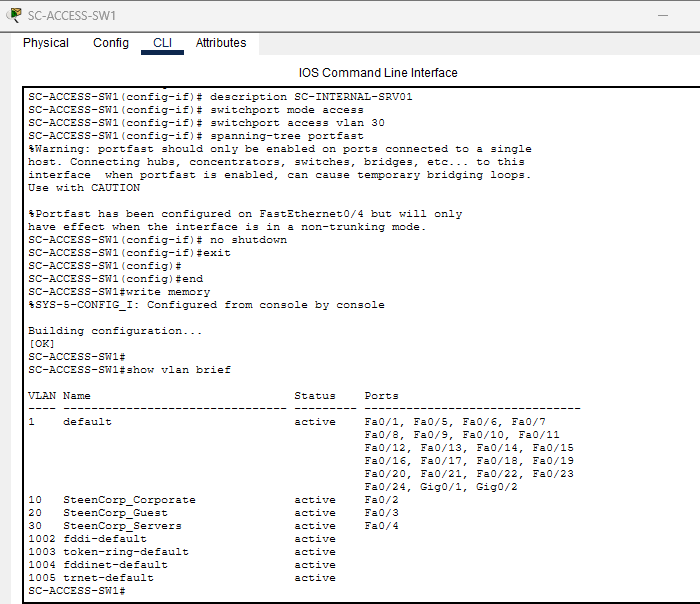
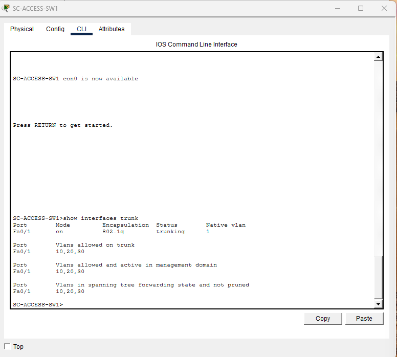
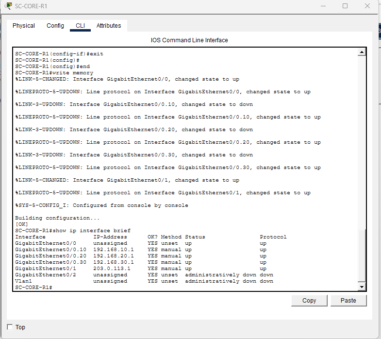
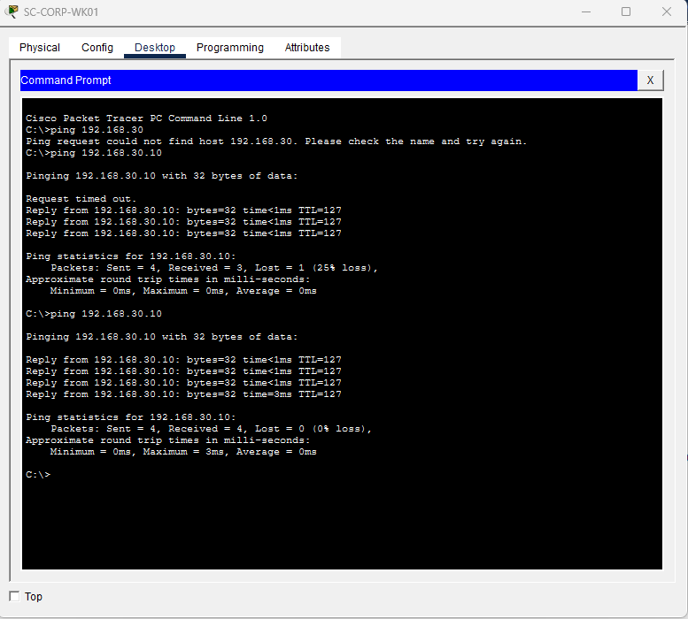
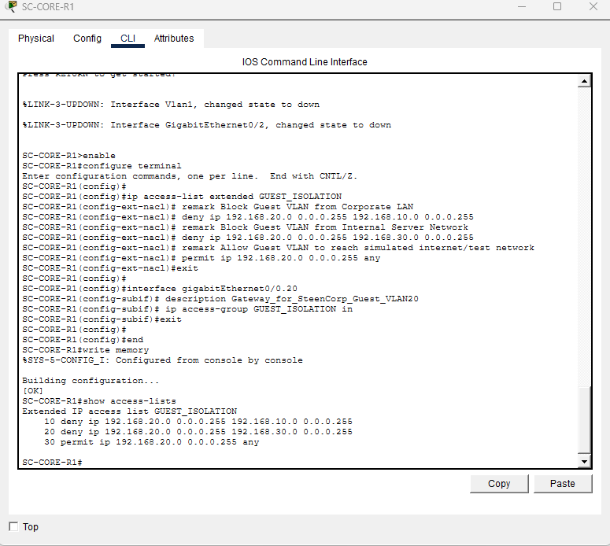
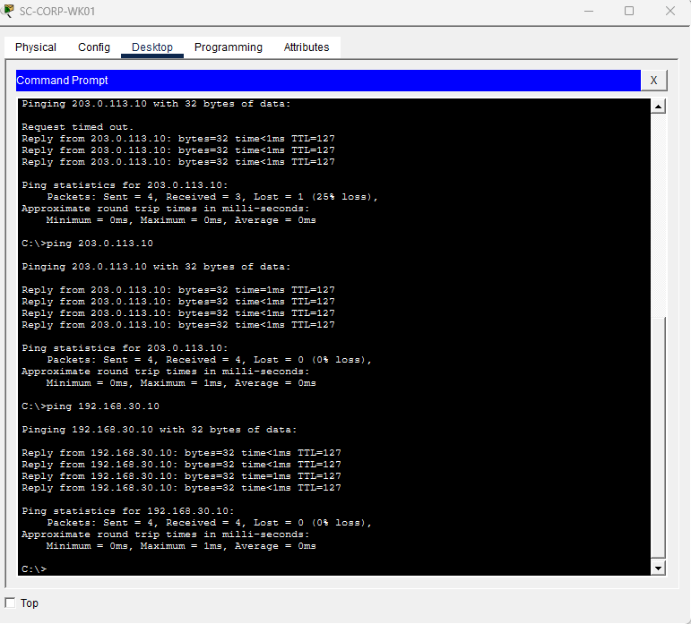
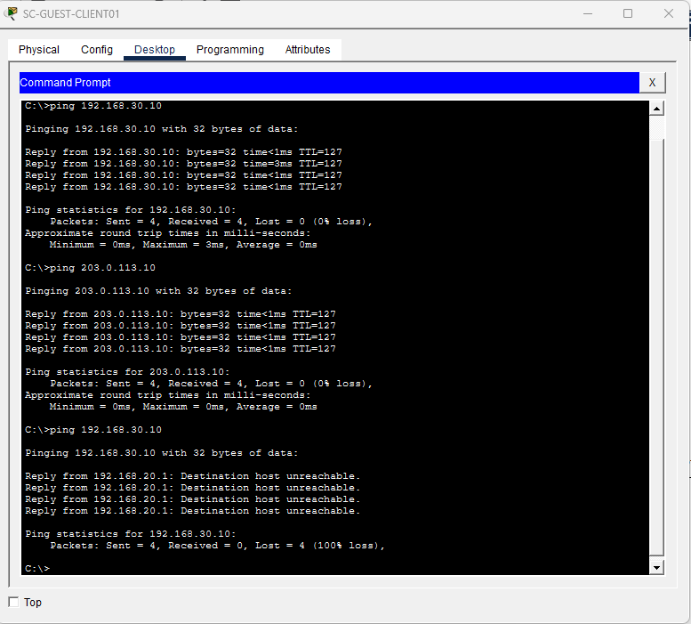
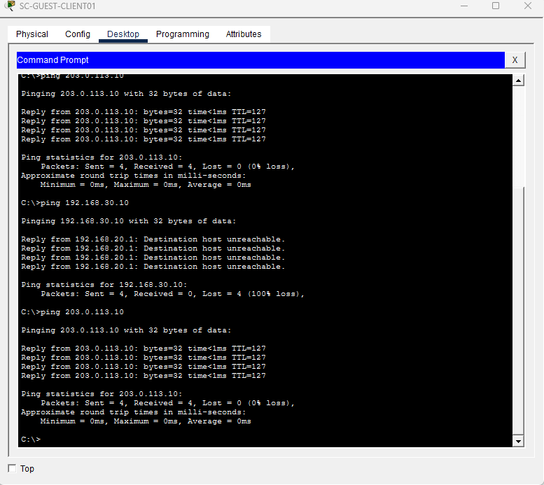

# SteenCorp Network Segmentation Lab


## Overview

The SteenCorp Network Segmentation Lab is a Cisco Packet Tracer project that demonstrates basic business network segmentation.

The lab separates corporate devices, guest devices, and internal servers using VLANs, trunking, router-on-a-stick, inter-VLAN routing, and access control lists.

The main goal was to allow guest devices to reach a simulated internet/test network while blocking them from internal company resources.

---

## Lab Scenario

SteenCorp wants to provide guest network access without allowing guest devices to reach internal systems.

Business requirements:

- Corporate users should be able to access internal resources.
- Internal servers should be separated from guest devices.
- Guest devices should not be able to access corporate or server networks.
- Guest devices should still be able to reach a simulated internet/test server.

This creates a simple business network security scenario: allow useful guest access without exposing internal resources.

---

## Network Design

| Network | VLAN | Subnet | Purpose |
|---|---:|---|---|
| Corporate LAN | VLAN 10 | `192.168.10.0/24` | Trusted employee devices |
| Guest Network | VLAN 20 | `192.168.20.0/24` | Guest/untrusted devices |
| Server Network | VLAN 30 | `192.168.30.0/24` | Internal company resources |
| Internet/Test Network | N/A | `203.0.113.0/24` | Simulated outside access |

---

## Devices

| Device | Purpose |
|---|---|
| `SC-CORE-R1` | Core router providing inter-VLAN routing |
| `SC-ACCESS-SW1` | Access switch with VLAN assignments |
| `SC-CORP-WK01` | Trusted corporate workstation |
| `SC-GUEST-CLIENT01` | Guest/untrusted client |
| `SC-INTERNAL-SRV01` | Internal SteenCorp server |
| `ISP-TEST-SRV01` | Simulated internet/test server |

---

## Topology

The lab was built with one router, one switch, one corporate workstation, one guest client, one internal server, and one simulated internet/test server.

```text
                  ISP-TEST-SRV01
                         |
                    SC-CORE-R1
                         |
                  SC-ACCESS-SW1
          /              |              \
 SC-CORP-WK01   SC-GUEST-CLIENT01   SC-INTERNAL-SRV01
    VLAN 10           VLAN 20             VLAN 30
```


---

## Implementation Summary

### VLAN Segmentation

Three VLANs were created on the access switch to separate devices by trust level and purpose.

| VLAN | Name | Purpose |
|---|---|---|
| VLAN 10 | `SteenCorp_Corporate` | Trusted employee workstation network |
| VLAN 20 | `SteenCorp_Guest` | Guest/untrusted device network |
| VLAN 30 | `SteenCorp_Servers` | Internal company server network |



---

### Trunking

The switch port connected to the router was configured as a trunk link.

This allowed VLAN 10, VLAN 20, and VLAN 30 traffic to travel between the switch and router over one physical connection.



---

### Router-on-a-Stick

Router-on-a-stick was used so one router interface could provide gateways for multiple VLANs.

| VLAN | Router Interface | Gateway |
|---|---|---|
| VLAN 10 | `G0/0.10` | `192.168.10.1` |
| VLAN 20 | `G0/0.20` | `192.168.20.1` |
| VLAN 30 | `G0/0.30` | `192.168.30.1` |
| Internet/Test Network | `G0/1` | `203.0.113.1` |



---

## Access Control

Before applying the ACL, the Guest PC could reach the internal server.

This mattered because it proved routing was working before security restrictions were applied.



An extended ACL was then applied inbound on the Guest VLAN router subinterface:

```text
G0/0.20
```

The ACL blocked guest traffic to internal SteenCorp networks while still allowing access to the simulated internet/test network.



---

## Validation

| Test | Expected Result | Actual Result |
|---|---|---|
| Corporate PC → Internal Server | Allowed | Successful |
| Corporate PC → Simulated Internet/Test Server | Allowed | Successful |
| Guest PC → Internal Server before ACL | Allowed | Successful |
| Guest PC → Internal Server after ACL | Blocked | Blocked |
| Guest PC → Simulated Internet/Test Server after ACL | Allowed | Successful |

### Corporate Access Allowed

Corporate devices were able to reach internal SteenCorp resources.



---

### Guest Access Blocked from Internal Server

Guest devices were blocked from reaching internal SteenCorp resources after the ACL was applied.



---

### Guest Access Allowed to Simulated Internet

Guest devices were still allowed to reach the simulated internet/test server.



---

## Packet Tracer File

The completed Cisco Packet Tracer lab file is included here:

[`SteenCorp_Network_Segmentation_Lab.pkz`](./PacketTracer/SteenCorp_Network_Segmentation_Lab.pkz)

---

## Configuration Reference

The Cisco CLI commands used to build this lab are documented separately.

| File | Purpose |
|---|---|
| [`01_Switch_VLAN_Trunk_Config.md`](./Configurations/01_Switch_VLAN_Trunk_Config.md) | Switch VLAN creation, access port assignments, and trunk configuration |
| [`02_Router_Subinterfaces_ACL_Config.md`](./Configurations/02_Router_Subinterfaces_ACL_Config.md) | Router subinterfaces, VLAN gateways, and guest isolation ACL |

---

## Skills Demonstrated

- Cisco Packet Tracer network design
- VLAN segmentation
- Trunk link configuration
- Router-on-a-stick
- Inter-VLAN routing
- 802.1Q VLAN tagging
- IP addressing and subnet planning
- Access control list configuration
- Guest network isolation
- Connectivity testing with ping
- Pre-change and post-change validation
- Technical documentation

---

## Final Outcome

This lab successfully demonstrates a segmented business network.

Corporate users can access internal resources, guest users are blocked from internal networks, and guest users can still reach a simulated internet/test server.

The project adds a networking-focused layer to the SteenCorp portfolio and shows how VLANs and ACLs can be used to enforce basic network separation.
