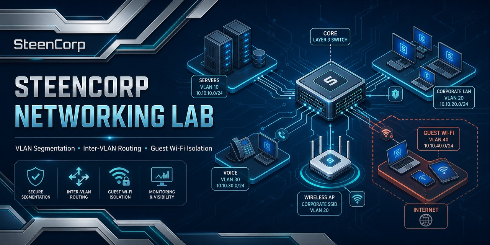

# SteenCorp Network Segmentation Lab



## Overview

The SteenCorp Network Segmentation Lab is a Cisco Packet Tracer project designed to demonstrate basic business network segmentation.

This lab shows how a company can separate trusted corporate devices, internal servers, and guest devices using VLANs, inter-VLAN routing, and access control rules.

The main goal of this project is to prove that guest devices can be isolated from internal company resources while still being allowed to reach a simulated internet/test network.

---

## Project Purpose

This project builds on the networking foundation from my SteenCorp Enterprise IT Lab.

In the original SteenCorp lab, I configured and validated the internal domain network using:

- `192.168.10.0/24` internal LAN
- DC01 as the domain controller
- DNS and DHCP services
- Windows Server and Windows 11 domain connectivity
- VMware network isolation

This project expands that idea into a segmented network design.

Instead of placing every device on one flat network, this lab separates devices by purpose and trust level.

---

## Lab Scenario

SteenCorp wants to provide guest network access without allowing guest devices to reach internal company systems.

The business requirement is:

- Corporate users should be able to access internal resources.
- Internal servers should be separated from guest devices.
- Guest devices should not be able to access internal company resources.
- Guest devices should still be able to reach a simulated internet/test server.

This creates a simple but realistic network security scenario.

---

## Network Design

| Network | VLAN | Subnet | Purpose |
|---|---:|---|---|
| Corporate LAN | VLAN 10 | `192.168.10.0/24` | Trusted employee devices |
| Guest Network | VLAN 20 | `192.168.20.0/24` | Guest/untrusted devices |
| Server Network | VLAN 30 | `192.168.30.0/24` | Internal company resources |
| Internet/Test Network | N/A | `203.0.113.0/24` | Simulated outside access |

---

## Topology

The lab uses a simple Packet Tracer topology:

- 1 router
- 1 switch
- 1 corporate workstation
- 1 guest workstation
- 1 internal server
- 1 simulated internet/test server

```text
                  Simulated Internet/Test Server
                              |
                           Router
                              |
                            Switch
                /             |              \
        Corporate PC      Guest PC      Internal Server
          VLAN 10          VLAN 20          VLAN 30
```


---

## Access Control Goals

| Source | Destination | Expected Result |
|---|---|---|
| Corporate PC | Internal Server | Allowed |
| Corporate PC | Internet/Test Server | Allowed |
| Guest PC | Internal Server | Blocked |
| Guest PC | Corporate LAN | Blocked |
| Guest PC | Internet/Test Server | Allowed |

The main security goal is to keep the guest network isolated from internal SteenCorp resources.

---

## Implementation Summary

### VLAN Segmentation

Separate VLANs were created to divide the network by device type and trust level.

- VLAN 10 for corporate users
- VLAN 20 for guest devices
- VLAN 30 for internal servers

This prevents all devices from existing on one flat network.

---

### Inter-VLAN Routing

Router-on-a-stick was used to allow controlled routing between VLANs.

Subinterfaces were configured on the router to act as default gateways for each VLAN.

Example gateway design:

| VLAN | Gateway |
|---|---|
| VLAN 10 | `192.168.10.1` |
| VLAN 20 | `192.168.20.1` |
| VLAN 30 | `192.168.30.1` |

---

### Guest Network Isolation

An access control list was applied to prevent guest devices from accessing internal SteenCorp resources.

The guest network was restricted from reaching:

- Corporate LAN
- Internal server network

The guest network was still allowed to reach the simulated internet/test network.

---

## Validation Results

| Test | Result |
|---|---|
| Corporate PC can ping internal server | Successful |
| Corporate PC can ping simulated internet/test server | Successful |
| Guest PC cannot ping internal server | Blocked |
| Guest PC cannot reach corporate LAN | Blocked |
| Guest PC can ping simulated internet/test server | Successful |

---

## Screenshot Evidence

| Evidence | Description |
|---|---|
| `01_Packet_Tracer_Topology.png` | Final Packet Tracer topology |
| `02_VLAN_Configuration.png` | VLANs configured on the switch |
| `03_Router_Subinterfaces.png` | Router-on-a-stick subinterfaces configured |
| `04_Corporate_PC_IP_Config.png` | Corporate PC IP configuration |
| `05_Guest_PC_IP_Config.png` | Guest PC IP configuration |
| `06_Corporate_To_Internal_Server_Allowed.png` | Corporate PC successfully reaches internal server |
| `07_Guest_To_Internal_Server_Blocked.png` | Guest PC blocked from internal server |
| `08_Guest_To_Internet_Test_Server_Allowed.png` | Guest PC reaches simulated internet/test server |
| `09_ACL_Configuration.png` | ACL used to restrict guest access |
| `10_Final_Validation_Summary.png` | Final validation results |

---

## Project Structure

<pre>
SteenCorp-Network-Segmentation-Lab/
│
├── README.md
│
├── PacketTracer/
│   └── SteenCorp_Network_Segmentation_Lab.pkt
│
├── Topology/
│   └── SteenCorp_Network_Segmentation_Topology.png
│
└── Evidence/
    ├── 01_Packet_Tracer_Topology.png
    ├── 02_VLAN_Configuration.png
    ├── 03_Router_Subinterfaces.png
    ├── 04_Corporate_PC_IP_Config.png
    ├── 05_Guest_PC_IP_Config.png
    ├── 06_Corporate_To_Internal_Server_Allowed.png
    ├── 07_Guest_To_Internal_Server_Blocked.png
    ├── 08_Guest_To_Internet_Test_Server_Allowed.png
    ├── 09_ACL_Configuration.png
    └── 10_Final_Validation_Summary.png
</pre>

---

## Skills Demonstrated

- Cisco Packet Tracer network design
- VLAN segmentation
- Inter-VLAN routing
- Router-on-a-stick configuration
- IP addressing and subnet planning
- Access control list usage
- Guest network isolation
- Basic network security design
- Connectivity testing with ping
- Network documentation
- Business-style topology planning

---

## What I Learned

- Flat networks are easier to build but harder to secure
- VLANs help separate devices by role, department, or trust level
- Guest networks should not have access to internal company resources
- ACLs can be used to enforce basic traffic restrictions
- Routing must be tested before adding access control rules
- Good network documentation makes troubleshooting easier
- A simple topology can still demonstrate an important security concept

---

## Future Improvements

Future versions of this lab could include:

- Voice VLAN design
- Wireless guest network simulation
- DHCP relay
- Port security
- Firewall-based segmentation
- Additional VLANs for printers, management, and security devices
- Syslog or network monitoring
- Integration with the SteenCorp Active Directory lab design

Voice VLANs were intentionally left out of the initial version to keep this project focused on core segmentation, routing, and guest isolation.

---

## Final Outcome

This lab successfully demonstrates a basic segmented business network.

The final design separates corporate users, internal servers, and guest devices into different networks. Guest devices are blocked from internal resources while still being allowed to reach a simulated outside network.

This project adds a networking-focused layer to the SteenCorp portfolio and supports the larger goal of building practical, job-ready IT experience.
